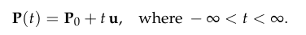
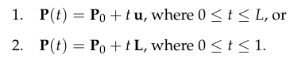
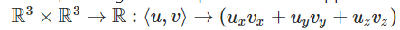
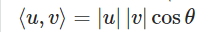
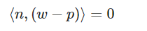
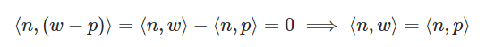
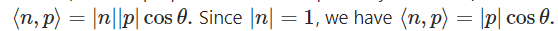

## BOOKS

REAL-TIME RENDERING FOURTH EDITION
Dave Mark's Behavioural Mathematics

## Errata

lightning -> lighting
13. Компютърна графика : enviorment slide 18
Anti-Aliasing slide picture is broken
15. компютърна графика: How is rasterization working briefly -> Briefly, how does rasterization work
15. Компютърна графика: GPU Architecture slide picture is broken
15. Компютърна графика: Stalls in a processor occurs, when the ALU units ...
15. Компютърна графика: As soon as the player moves thame camera
17. someway - some way
18. animations tp control -> to control
19. deserialzies -> deserializes
too mach -> too much
20. Let's you have clear rules  -> Clear rules for conflict resolution (server is single source of truth)
20. is what UE calls it's synchronization -> its
21. A black board is **a** basically a map **G**ame designers can access
23. Each frame call**_** a special method
23. much better works with -> Good utilization of // also use ordered list instead of unordered
24. what's an reflex agent -> what's a reflex agent
24. Texture ot Material -> texture or material
24. Manual Archors -> Manual anchors
22. Let's you -> Lets you (slide 9)

## Video Comments

1.  Упражнение в Unreal
1:05:00

1.  Компютъра графика в Unreal
00:00 - 15:34 1st. homework discussion
15:34 - ? Review

? - 57:00 Break

17. Animations
58:00 - 1:14:00 Break

18. Animations in Unreal
15:05 - ? start
50:20 - 1:02:00 - Break

20. Networking in UE
21. 3:28 - ? Review

## TODO
optional exercise at end of 14. Упражнение в Unreal
optional exercie at end of 18. animations in Unreal

## Improvements:

13. Компютърна графика за игри 1: visualizations for lighting types

13. Компютърна графика за игри 1: липсва детаилен слайд за shadow maps
e.g. peter panning
shadow acne

секции за видеа

Cascaded shadow maps slide: i don't understand

Въпрос към execise 3 & 4: Зашо пускаме таймер в AUE5TopDownARPGCharacter::TakeAnyDamage при Health <= 0.0f? Защо не викнем AUE5TopDownARPGCharacter::Death директно?

HW 1: (https://tinyurl.com/gaehw1)
Rename DamageOverTimeTick -> DamageInterval

Въпрос към excercise 4: Защо слагаме Damage в Projectile, а не в BoltAbility?
Въпрос към exercise 4: Защо държим указател “FTimerManager* TimerManager = nullptr;” в класа BaseAbility, вместо да взимаме &World->GetTimerManager(), когато ни потрябва?

17. Animations: add image for IK

19. Networking: differentiate select() and poll() on slide

## Questions

17. Анимация: В Unreal Engine можем ли да изберем между двата вида взаимно-изключаеми оптимизации: вкарването на WorldMatrix в skinning матриците VS animation instancing

17. Animaction: in the animation pipeline, why do we convert to global coordinates two times?

18. slide 64: we're projecting the world N times for each action, but that would imply that we can execute said action multiple times in a row. But this not always possible for abilities in games, e.g. cooldowns

22. Video is missing?

# Learn Book

# I. Foundations

**SIMT, explain what and used where**
- Single Instruction Multiple Thread, forms the basis of all modern GPUs

Extra: a combination of SIMD + multithreading

**rigid transformation; explain:**
- only rotation & translation, no scale. I.e. 'corkscrew motion'

extra: can be represented using *dual quaternion*

**Lines, Rays, Line Segments; mathematical representation**
- Line: 
- Ray: Same as Line, but ```t >= 0```
- Line Segment: Where L = P1 − P0, (length of segment)


**Plane Formula**
- Ax + By + Cz + D = 0

Extra: In case of plane through origin, i.e. D=0:
Dot product:  
also:



= 0 iff two vectors are perpendicular (cos(pi/2)=0) 

Extra: In case of plane not through origin:

W: arbitrary point to test
P: some point in plane
N: plane normal

test with:







= D

# Learn Course

## Legend

!!! Review Questions

!! Non-Review Info From slides

! Extra Info From Internet / the Book

