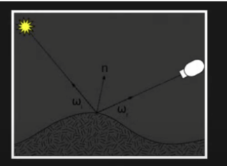
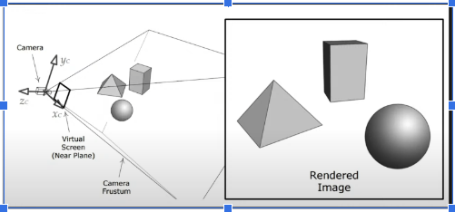
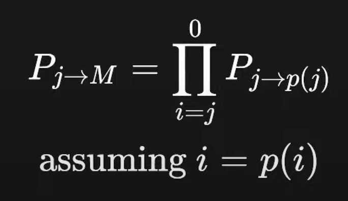
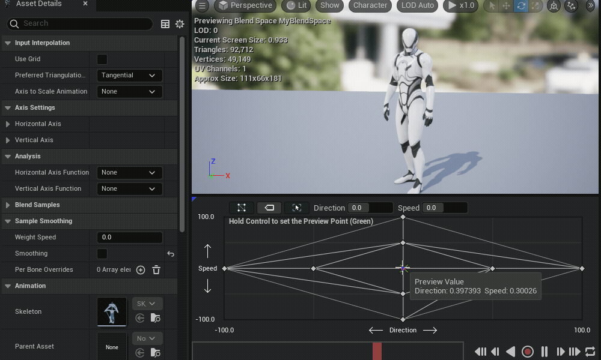

## 13. Компютърна графика 1: 

## !! bounding volumes vs collision primitives:**
synonyms

## !! basic algorithm for computing the position of an object out of forces:**
a = F/m
integral a = integral F/m
v = integral F/m

## !!Why is TIME_STEP a constant in PhysicsEngine::Step()?**
because the integrator would make a huge mistake in case of slowed framerate

## !! Tesselation vs Triangulation vs Subdivision:**

- Tessellation: Dynamically adds detail in games,
- Triangulation: ensure compatibility and efficiency with rendering hardware,  
- Subdivision: for creating smooth surfaces in 3D Design apps.

## !!! Name light types:**

directional lights: simplification of sun’s light, because the sun is so far away. Cheap
point lights: cheap
spot lights: The light is emitted from a single point and spreads outwards in a cone.
area lights:  the light is emitted from the entire surface of the light source
emissive: materials which emit lights (end effect is like area lights)
environment (sky): ambient light that simulates complex lighting

## !!! BRDF: bidirectional reflectance distribution function**

How much light is reflected from incoming to outgoing direction
 

## !! the only non-affine transformation we use in computer graphics:**
the camera projection


## !! Rendering methods:**
- Phong
- Physically Based Rendering (Disney)
- Ray tracing

## !!! Rasterization, explain:**
1. Goes through each object 1 by 1 and draws it using the pipeline 
2. Uses Z-Buffer to prevent depth issues

## !!! G-Buffer stores:**
- Normal
- Diffuse Color
- Roughness

## 15. Компютърна графика 2

## !! GPU vs CPU optimization:**
- CPU: Low latency, low throughput (ns, <100GB/s)
- GPU: High latency, high throughput (ms, >100GB/s)

## !! morton order:**
optimize texture cache for locality


## 16. Компютъра графика в Unreal:

## !!! What are the 3 collision responses in Unreal?**
- Block
- Overlap
- Ignore

## !!! Name types of traces in UE5**
- by Channel
- by Object Type

## !!! Rendering is usually split in 3 levels:**
- the graphics device
- utilities for rendering common things - cubes, lines, models
- the scene graph

## !!! UE Rendering Main Components (3):**
- RHI: Rendering Hardware Interface
- RenderCore: utilities, mostly thread management
- Renderer: everything else

## !! Command (Task) Pattern, explain in 4:**
- Create functor that holds some state
- Store functor in Queue of Commands
- Execute when neccessary
- Used for multithreading; undo/redo systems

## !! UE Shaders, explain in 4:**
- Written in HLSL
- Transpiled by Unreal Shader Compiler for the target platform
- Stored in Engine/Shaders in .usf* files
- Need a CPP equivalent class

## !!!  UE RenderCore, RHI, Renderer explain in 3:**
- RenderCore manages the RHI thread and the RenderCore thread
- Rendering enqueues commands for the RHI thread
- RHI thread executes graphics-device commands

## !! UE FRenderCommandFence, explain in 1:**
- A command issues to the Renderer queue which signals the CPU that the GPU has reached this point of execution (like a semaphore)

## !! UE Fence example:**
```
class AMyActor : public AActor { FrenderCommandFence Fence; };
void AMyActor::BeginDestroy() { Fence.BeginFence();}
bool AMyActor::IsReadyForFinishDestroy() { return Fence.IsFenceComplete(); }
```

## !! UE Rendering & Game thread memory architecture (2):**
- UE objects are not thread-safe
- The rendering thread has its own set of classes, e.g. UWorld (game) -> FScene ( Rendering)

## !! UE Materials: (1)**
- Compile to HLSL

## !! PBR 4 main values:**

Physically Based Rendering uses
- Base Color
- Roughness
- Metallic
- Specular

## !! Name UE's lighting baking tool:**
- Lightmass

## !! Name UE's parallel computing tool for lighting baking:**
- Swarm Agent

## !! What does normal map do in UE's Material Graph?:**
- Make plain surfaces more complex

## 17 Animation

## !!! What odes the vertex shader do (1)?**
- input: vertex data; transform; output: vertex data
- usually converts model space to screen space

## !!! What does the pixel shader do (2)?**
- input: pixel data, output: final color
- For each pixel, return a 4D Vector, R,G,B,A

## !!! Where does lighting usually happen in the rendering pipeline?**
- pixel shader

## !! What is BindPose:**
- T-Pose

## !! struct JointPose:**
- float Quaternion[4];
- float Translation[3];
- float Scale; // or float Scale[3] if we want animations to lead to model size increase

## !! When is animation calculated?**
- vertex shader

## !! animation: The transform from join to model space is:**


## !! timeline types (3):**
- Local
- Global
- Normalized

## !! struct SkinnedVertex:**
```
{
float Position[3];
// also texture, normal, tangent, etc.
unsigned char JointIndices[4]; // 4 is plenty
float JointWeights[3]; // weights are normalized. Last one is 1 - sum of rest
}
```

## !! skinning matrix:**
 - the matrix transforming from B (Bind pose) to C (Current Pose)


## !! The set of skinning matrices for each join is known as:**
- matrix palette

## !! The optimization of repeating the same vertex calculations for many units identical is known as:**
- animation instancing

## !! Given 2 clips, transition from one to another (walking to running) is known as:**
- animation blending

## ! Name of Geometric formula used for smooth animation blending of rotations:**
- Slerp (Spheical Linear Interpolation) is used for smooth blending of quaternions

(Linear interpolation (lerp) between quaternions can result in changes of speed and non-uniform rotations)

## !!! SQT meaning:**
- Scale factor 
- Quaternion (for rotation)
- Translation vector (for moving) 

Extra: Used instead of matrices for animation blending using 1. LERP, 2. SLERP, 3. LERP

implement run-and-wave:
1. partial blending: 
- Disable the right-hand joints for the running animation
- enable the right hand joints for the waving animation
2. Additive blending

## ! Animations IK vs FK, explain**
- Forward Kinematics: explicitly set the angle of each join
- Inverse Kinematics: Calculate the necessary join movements to place a joint at a specific position in space

## !! UE animation editing tool, give name:**
- Persona

## !! UE: function to translate an animation between similar skeletons, (name)**
- animation retargeting

## 19. Networking

## !!! What is an animation clip?**
- a clip is a list of animation poses. 

extra: The animation is the interpolation between each pose in the clip

## !! Low level networking API (name)**
- BSD sockets API

## !! BSD sockets API: 5 functions on the server side**
- socket()
- close()
- bind()
- listen()
- accept()

Extra

*bind*: assigns local IP address and port to a socket

*listen*:  makes a bound socket listen for incoming connections; marks the socket as a passive socket, i.e. used to accept incoming requests rather than initiate connections.

*accept*: typically  inside a loop; is a blocking; when a client connects, creates a new connected socket, specifically for this connection. The original socket remains in a listening state.

## !! BSD sockets API: 1 function on the client side**
- connect()

## !! TCP 2 functions on the client&server side to exchange data**
- send() [or write() in linux/BSD]
- recv() [or read() in linux/BSD]

## !! UDP 2 functions on the client&server side to exchange data**
- sendto()
- recvfrom()

## !! BSD sockets 2 functions for DNS**
- gethostbyname()
- gethostbyaddr()

## !! BSD sockets 2 functions for async programming**
- select()
- poll()
## !! RUDP, meaning**
- Reliable UDP (most engines have a built-in implementation)

## !! method name for connecting through router**
STUN (Session Traversal Utilities for NAT) facilitates P2P

extra: NAT = Network Address Translation

TODO [1:17:58 ](https://youtu.be/YChHGZE-8rg?si=4mt-p8-cwdP14Q5F&t=4678)

## 20. Networking in Unreal

## !!! Root motion, explain**
- A system that enables animations to control the movement of the character
## !!! Blend Space, explain**


## !!enum ENetRole**
```
{
    ROLE_None,
    ROLE_SimulatedProxy,    /* This (client) computer only simulates; No control over the actor. Client extrapolates between server updates */
    ROLE_AutonomousProxy,   /* This (client) computer controls the actor; No ultimate authority */
    ROLE_Authority,         /* This (server) computer has ultimate authority; i.e. you're Server */
    ROLE_MAX,
}
```

## !! 4 AActor Members for Networking:**
- ENetRole AActor::Role
- ENetRole AActor::RemoteRole
- bool AActor::IsNetRelevantFor()
- float AActor::GetNetPriority()

## !! 2 Classes which are not synchronized**
- AActor => AInfo => AGameModeBase => AGameMode (holds the game's rules) -> Server
- AActor => Acontroller => APlayerController (the player's rules. Represents the human player's will) -> Client

=> is class hierarchy


## 21. AI

## !! state machine, decision tree vs behavior tree**
- state machine: Directed-Acyclic-Graph, has states
- decision tree: tree, has no states
- behavior tree: tree with states

## !! AI: A system that oversees several NPCs and organized them**
- Game director / overseer

extra: e.g. applies flocking behavior or distributes different NPCs todifferent tasks

## 22. AI un UE
## !! Network Distribution model in UE:**
- Client-Server

## !! What are the network roles in UE (ENetRole)**
- ROLE_Authority
- ROLE_SimulatedPRoxy
- ROLE_AutonomousProxy

## !! UE APawn (2) vs ACharacter (4)**
* APawn
  * an AActor
  * can be possessed by a Controller
* ACharacter
  * an APawn
  * has MeshComponent for visualization
  * has CapsuleComponent for collision
  * has CharacterMovementComponent for movement

## !! 3 types of controllers**
* AController
  * responsible for directing a Pawn. A controller can 'possess' a Pawn
* APlayerController
  * the will of the player
* AAIController
  * the will of the AI
extra: nothing stops us from not using any controller classes. It's just not good code

## !! In UE which system lets you move actors**
- UNavigationSystem

## !! EQS in UE, define**
- Environment Query System
- Answers: where is the optimal place to position a character, taking into account enemies, friends, etc.

## 23. UI
## !! 2 Main UI Architectures**
- Immediate Mode: no state, you need to call drawButton on every tick
- Retained Mode: UI has state of its own

## 24. UI in UE5
## !!! Reflex agent**
- AI that performs actions based solely on the current situation

## !!! Behavior Tree Flow Control Nodes, (3)**
- Selector: try a list of possible actions until one succeeds. E.g. Try to hit with ability A, then B, then C 
- Sequence: do a list of actions until one of the actions fails, then stop the sequence. E.g. find, go to, kill
- Simple Parallel: e.g. while running, aim at enemy

## !! Name UI systems in UE (2)**
- Slate - Low-level, C++ driven
- UMG (Unreal Motion Graphics) - high-level, WYSIWYG, uses Slate under the hood

## !! Rendering Modes**
- Immediate Mode (imGui, OpenGL)
- Retained Mode (most app frameworks, MVC)

## !! HUD meaning**
- Heads Up Display

extra: Referenced in APlayerController; container for widgets

## !! Open-source HTML engine for UE (plugin)**
- BLUI, based on Chromium

## 25. Tools

## !! Methods for font rendering**
- Rasterization
- SDF

## !! UE: stomp allocator**
- allocates extra memory for array to test array write overflow
,

## !! how do pdb's work


gaehw1 aoe: in ue5 create mesh with integrated collision that says 'call this function on collision'

::DebugBreakpoint on windows

how to debug GPU
- drawing red pixels
- GPU debuggers: RenderDoc, Nvidia Nsight, VS's graphics debugger
- disable passes

ask victor about statFPS

statistical vs instrumentation profiles


## Tools in UE
**key sellings points of Slate**
- Easily extensible
- Declarative

**key selling points of UMG**
- Animations are much easier compared to Slate
- No need for a programmer